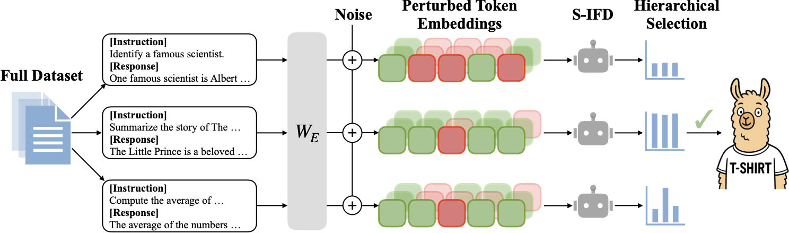

# T-SHIRT: Token-Selective Hierarchical Data Selection for Instruction Tuning

[Yanjun Fu](https://dynamite321.github.io/), [Faisal Hamman](https://www.faisalhamman.com/), [Sanghamitra Dutta](https://sites.google.com/site/sanghamitraweb/)

[[📖 Paper](https://arxiv.org/abs/2506.01317)]

## Overview


<details><summary>Abstract</summary> 
Instruction tuning is essential for Large Language Models (LLMs) to effectively follow user instructions. To improve training efficiency and reduce data redundancy, recent works use LLM-based scoring functions, e.g., Instruction-Following Difficulty (IFD), to select high–quality instruction-tuning data with scores above a threshold. While these data selection methods often lead to models that can match or even exceed the performance of models trained on the full datasets, we identify two key limitations: (i) they assess quality at the sample level, ignoring token-level informativeness; and (ii) they overlook the robustness of the scoring method, often selecting a sample due to superficial lexical features instead of its true quality. In this work, we propose Token-Selective HIeRarchical Data Selection for Instruction Tuning (T-SHIRT), a novel data selection framework that introduces a new scoring method to include only informative tokens in quality evaluation and also promote robust and reliable samples whose neighbors also show high quality with less local inconsistencies. We demonstrate that models instruction-tuned on a curated dataset (only 5% of the original size) using T-SHIRT can outperform those trained on the entire large-scale dataset by up to 5.48 points on average across eight benchmarks. Across various LLMs and training set scales, our method consistently surpasses existing state-of-the-art data selection techniques, while also remaining both cost-effective and highly efficient. For instance, by using GPT-2 for score computation, we are able to process a dataset of 52k samples in 40 minutes on a single GPU.
</details>

## Requirements

To install the required packages for Python 3.12:

```bash
pip install -r requirements.txt
```

## Data Selection

To select data, run the following command:

```bash
bash scripts/select_data.sh
```

Data selected from Alpaca-GPT4 and Magpie is provided in `datasets/alpaca_gpt4` and `datasets/alpaca_magpie`.

## Training

To train the model(s) described in the paper, run one of the following commands:

```bash
bash scripts/train_qwen25_7b.sh tshirt_k_50 datasets/alpaca_gpt4/tshirt_k_50.json
```

or

```bash
bash scripts/train_llama31_8b.sh tshirt_k_75 datasets/alpaca_gpt4/tshirt_k_75.json
```

## Evaluation

### OpenLLM Leaderboard Benchmarks

We evaluate instruction-tuned models on six OpenLLM Leaderboard benchmarks. For detailed instructions, please refer to the [official LM-Eval-Harness repository](https://github.com/EleutherAI/lm-evaluation-harness).

Specifically, we use the following benchmarks:

* [ARC-Challenge](https://github.com/EleutherAI/lm-evaluation-harness/tree/main/lm_eval/tasks/arc)
* [HellaSwag](https://github.com/EleutherAI/lm-evaluation-harness/tree/main/lm_eval/tasks/hellaswag)
* [MMLU](https://github.com/EleutherAI/lm-evaluation-harness/tree/main/lm_eval/tasks/mmlu)
* [TruthfulQA](https://github.com/EleutherAI/lm-evaluation-harness/tree/main/lm_eval/tasks/truthfulqa)
* [BBH](https://github.com/EleutherAI/lm-evaluation-harness/tree/main/lm_eval/tasks/leaderboard/bbh_mc)
* [GSM8k](https://github.com/EleutherAI/lm-evaluation-harness/tree/main/lm_eval/tasks/gsm8k)

The corresponding LM-Eval-Harness task names are:

```
arc_challenge, hellaswag, mmlu, truthfulqa_mc2, leaderboard_bbh, gsm8k
```

### Arena-Hard

We use `Gemini-2.5-Flash-Preview-04-17` as the judge for Arena-Hard-v0.1. Please refer to the [official Arena-Hard repository](https://github.com/lmarena/arena-hard-auto) for evaluation details.

### AlpacaEval-2.0

We use `GPT-4o-2024-08-06` as the judge for AlpacaEval-2.0. Please refer to the [official AlpacaEval-2.0 repository](https://github.com/tatsu-lab/alpaca_eval) for evaluation details.

## Citation

If you find our work helpful, please consider citing our paper:

```bibtex
@inproceedings{
fu2025tshirt,
title={T-{SHIRT}: Token-Selective Hierarchical Data Selection for Instruction Tuning},
author={Yanjun Fu and Faisal Hamman and Sanghamitra Dutta},
booktitle={The Thirty-ninth Annual Conference on Neural Information Processing Systems},
year={2025},
}
```